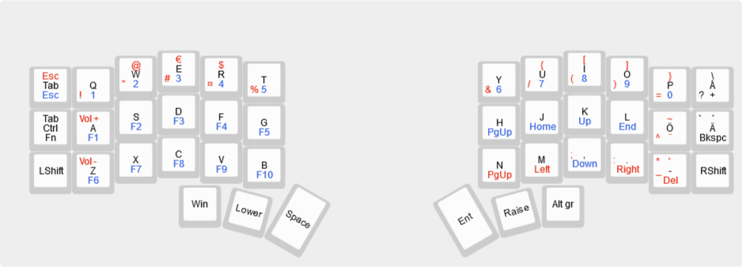

# Crkbd with classic Swedish inspired mapping

Since the swedish keyboard is a bit fun-key due to placement of Swedish letters åäö, {[]} and most other special
characters this is an attempt to move those keys into positions that would feel pretty natural to a Swedish keymap 
touchtype user.

## Layer, space, enter, gui

Layer, space, enter and gui keys follow the crkbd default layout.

## alt, alt-gr

On Swedish keyboards there is a subtle distinction between left and right alt.
Right alt is called alt-gr and it has special powers.

Most alt-gr:ed characters has been moved into the Raised layer.
Normal special character can be shifted from Lowered numbers.

## Arrows and other movement

Aiming at a classic setup and having the ring finger normally on k
the arrow keys are placed on lowered KM,.

## Legend

The layout image above shows the keymap, with each key marked with all three layers:

- The top indicates the raise layer
- The middle indicates the default layer
- The bottom indicates the lower layer
- Characters to the left is shifted.

All the keys respond as you'd expect to the 'shift' key - i.e. on a UK/GB keyboard, `/` becomes `?` and so on.

//TODO: fix keymap.c to reflect image.
